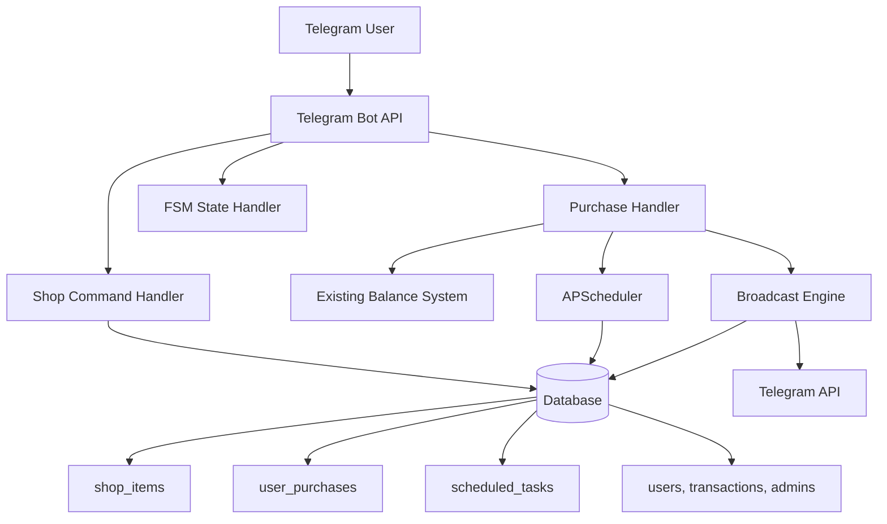

# Design Document: Telegram Bot Shop System

## Overview

The Telegram Bot Shop System is a comprehensive e-commerce module that integrates with an existing Telegram bot to provide virtual item purchasing capabilities. The system manages three distinct shop items: unlimited stickers (24-hour duration), admin rights requests, and broadcast messaging services. All items are priced at 100 coins and utilize the existing bot's balance system.

The architecture emphasizes reliability through persistent task scheduling, graceful error handling, and seamless integration with existing bot infrastructure. The system uses APScheduler for time-based operations, finite state machines for conversation flow management, and comprehensive database persistence to ensure data integrity across bot restarts.

## Architecture

The shop system follows a modular architecture that integrates with the existing bot infrastructure:



### Core Components

1. **Shop Handler**: Manages `/shop` command and item display
2. **Purchase Handler**: Processes purchase commands and validates balances
3. **Item Processors**: Specialized handlers for each shop item type
4. **Scheduler Manager**: Manages APScheduler for delayed operations
5. **Broadcast Engine**: Handles mass message distribution with rate limiting
6. **FSM Manager**: Manages conversation states for interactive purchases
7. **Database Manager**: Handles all database operations and migrations

## Components and Interfaces

### Shop Handler Component

```python
class ShopHandler:
    def __init__(self, db_manager: DatabaseManager):
        self.db = db_manager
    
    def display_shop(self, user_id: int) -> str:
        """Generate formatted shop display message"""
        pass
    
    def get_shop_items(self) -> List[ShopItem]:
        """Retrieve all available shop items"""
        pass
```

### Purchase Handler Component

```python
class PurchaseHandler:
    def __init__(self, db_manager: DatabaseManager, balance_system: BalanceSystem):
        self.db = db_manager
        self.balance = balance_system
    
    def process_purchase(self, user_id: int, item_id: int) -> PurchaseResult:
        """Process a purchase request with balance validation"""
        pass
    
    def validate_balance(self, user_id: int, required_amount: int) -> bool:
        """Check if user has sufficient balance"""
        pass
    
    def deduct_balance(self, user_id: int, amount: int) -> bool:
        """Deduct coins from user balance"""
        pass
```

### Item Processor Interface

```python
from abc import ABC, abstractmethod

class ItemProcessor(ABC):
    @abstractmethod
    def execute(self, user_id: int, purchase_data: dict) -> ProcessResult:
        """Execute the item-specific logic after purchase"""
        pass

class StickerItemProcessor(ItemProcessor):
    def __init__(self, scheduler: SchedulerManager, bot: TeleBot):
        self.scheduler = scheduler
        self.bot = bot
    
    def execute(self, user_id: int, purchase_data: dict) -> ProcessResult:
        """Send sticker message and schedule deletion"""
        pass

class AdminRequestProcessor(ItemProcessor):
    def __init__(self, bot: TeleBot, owner_id: int):
        self.bot = bot
        self.owner_id = owner_id
    
    def execute(self, user_id: int, purchase_data: dict) -> ProcessResult:
        """Send admin request to bot owner"""
        pass

class BroadcastProcessor(ItemProcessor):
    def __init__(self, fsm_manager: FSMManager):
        self.fsm = fsm_manager
    
    def execute(self, user_id: int, purchase_data: dict) -> ProcessResult:
        """Initiate broadcast text collection state"""
        pass
```

### Scheduler Manager Component

```python
from apscheduler.schedulers.background import BackgroundScheduler
from apscheduler.jobstores.sqlalchemy import SQLAlchemyJobStore

class SchedulerManager:
    def __init__(self, db_url: str):
        self.scheduler = BackgroundScheduler()
        self.setup_persistence(db_url)
    
    def setup_persistence(self, db_url: str):
        """Configure SQLite persistence for scheduler"""
        pass
    
    def schedule_message_deletion(self, chat_id: int, message_id: int, 
                                delay_hours: int = 24):
        """Schedule a message for deletion"""
        pass
    
    def restore_scheduled_tasks(self):
        """Restore scheduled tasks from database on startup"""
        pass
```

### Broadcast Engine Component

```python
import asyncio
from typing import List

class BroadcastEngine:
    def __init__(self, bot: TeleBot, db_manager: DatabaseManager):
        self.bot = bot
        self.db = db_manager
        self.rate_limit_delay = 0.15  # 150ms between messages
    
    async def broadcast_message(self, sender_id: int, message_text: str) -> BroadcastResult:
        """Send message to all users with rate limiting"""
        pass
    
    def get_all_users(self) -> List[User]:
        """Retrieve all users from database"""
        pass
    
    def format_broadcast_message(self, user: User, message_text: str) -> str:
        """Format message with user mention"""
        pass
```

### FSM Manager Component

```python
from enum import Enum

class BroadcastState(Enum):
    WAITING_FOR_TEXT = "waiting_for_text"

class FSMManager:
    def __init__(self):
        self.user_states = {}
    
    def set_state(self, user_id: int, state: BroadcastState, data: dict = None):
        """Set user conversation state"""
        pass
    
    def get_state(self, user_id: int) -> tuple:
        """Get current user state and associated data"""
        pass
    
    def clear_state(self, user_id: int):
        """Clear user conversation state"""
        pass
```

## Data Models

### Database Schema Extensions

The system extends the existing database with three new tables:

```sql
-- Shop items configuration
CREATE TABLE shop_items (
    id INTEGER PRIMARY KEY AUTOINCREMENT,
    name VARCHAR(100) NOT NULL,
    price INTEGER NOT NULL DEFAULT 100,
    description TEXT,
    is_active BOOLEAN DEFAULT TRUE,
    created_at TIMESTAMP DEFAULT CURRENT_TIMESTAMP
);

-- User purchase history
CREATE TABLE user_purchases (
    id INTEGER PRIMARY KEY AUTOINCREMENT,
    user_id INTEGER NOT NULL,
    item_id INTEGER NOT NULL,
    purchase_time TIMESTAMP DEFAULT CURRENT_TIMESTAMP,
    expires_at TIMESTAMP NULL,
    data JSON NULL,  -- Additional item-specific data
    FOREIGN KEY (user_id) REFERENCES users(id),
    FOREIGN KEY (item_id) REFERENCES shop_items(id)
);

-- Scheduled task management
CREATE TABLE scheduled_tasks (
    id INTEGER PRIMARY KEY AUTOINCREMENT,
    user_id INTEGER NOT NULL,
    message_id INTEGER NULL,
    chat_id INTEGER NOT NULL,
    task_type VARCHAR(50) NOT NULL,
    execute_at TIMESTAMP NOT NULL,
    task_data JSON NULL,
    is_completed BOOLEAN DEFAULT FALSE,
    created_at TIMESTAMP DEFAULT CURRENT_TIMESTAMP,
    FOREIGN KEY (user_id) REFERENCES users(id)
);
```

### Data Transfer Objects

```python
from dataclasses import dataclass
from datetime import datetime
from typing import Optional, Dict, Any

@dataclass
class ShopItem:
    id: int
    name: str
    price: int
    description: str
    is_active: bool = True

@dataclass
class Purchase:
    id: int
    user_id: int
    item_id: int
    purchase_time: datetime
    expires_at: Optional[datetime] = None
    data: Optional[Dict[str, Any]] = None

@dataclass
class ScheduledTask:
    id: int
    user_id: int
    chat_id: int
    task_type: str
    execute_at: datetime
    message_id: Optional[int] = None
    task_data: Optional[Dict[str, Any]] = None
    is_completed: bool = False

@dataclass
class PurchaseResult:
    success: bool
    message: str
    error_code: Optional[str] = None

@dataclass
class BroadcastResult:
    total_users: int
    successful_sends: int
    failed_sends: int
    errors: List[str]
```

### Configuration Models

```python
@dataclass
class ShopConfig:
    owner_id: int
    default_item_price: int = 100
    sticker_duration_hours: int = 24
    broadcast_rate_limit: float = 0.15
    max_broadcast_retries: int = 3

@dataclass
class DatabaseConfig:
    db_url: str
    scheduler_db_url: str
    connection_pool_size: int = 5
```

## Error Handling

### Error Categories and Responses

1. **Insufficient Balance Errors**
   - Detection: Balance check before purchase processing
   - Response: "Недостаточно средств! Ваш баланс: X"
   - Recovery: User can earn more coins or purchase cheaper items

2. **Telegram API Errors**
   - Rate limiting: Implement exponential backoff
   - Blocked users: Log and continue operation
   - Network errors: Retry with circuit breaker pattern
   - Invalid chat/user: Skip and log for investigation

3. **Database Errors**
   - Connection failures: Implement connection pooling and retry logic
   - Transaction conflicts: Use database-level locking
   - Data integrity: Validate all inputs before database operations

4. **Scheduler Errors**
   - Job execution failures: Log and attempt manual cleanup
   - Persistence failures: Fallback to in-memory scheduling
   - Timezone issues: Use UTC for all stored timestamps

### Error Handling Patterns

```python
class ShopError(Exception):
    """Base exception for shop-related errors"""
    pass

class InsufficientBalanceError(ShopError):
    def __init__(self, user_id: int, current_balance: int, required: int):
        self.user_id = user_id
        self.current_balance = current_balance
        self.required = required
        super().__init__(f"User {user_id} has {current_balance}, needs {required}")

class TelegramAPIError(ShopError):
    def __init__(self, error_code: str, description: str):
        self.error_code = error_code
        self.description = description
        super().__init__(f"Telegram API error {error_code}: {description}")

# Error handling decorator
def handle_shop_errors(func):
    def wrapper(*args, **kwargs):
        try:
            return func(*args, **kwargs)
        except InsufficientBalanceError as e:
            return PurchaseResult(
                success=False,
                message=f"Недостаточно средств! Ваш баланс: {e.current_balance}",
                error_code="insufficient_balance"
            )
        except TelegramAPIError as e:
            logger.error(f"Telegram API error: {e}")
            return PurchaseResult(
                success=False,
                message="Произошла ошибка при обработке запроса",
                error_code="api_error"
            )
    return wrapper
```

## Testing Strategy

The testing approach combines unit tests for individual components with integration tests for end-to-end workflows. Property-based testing validates system behavior across various input combinations.

### Unit Testing Focus Areas

- **Purchase validation logic**: Test balance checking and deduction
- **Message formatting**: Verify correct Russian text formatting
- **Database operations**: Test CRUD operations and data integrity
- **Error handling**: Verify appropriate error responses
- **Configuration management**: Test bot owner setup and item configuration

### Integration Testing Scenarios

- **Complete purchase flows**: From command to item delivery
- **Scheduler integration**: Message scheduling and deletion
- **Broadcast workflows**: FSM state management and mass messaging
- **Database persistence**: Data survival across bot restarts
- **API rate limiting**: Telegram API compliance during broadcasts

### Property-Based Testing Configuration

The system uses Hypothesis for Python property-based testing with the following configuration:
- Minimum 100 iterations per property test
- Custom generators for Telegram user data, message content, and purchase scenarios
- Each property test references its corresponding design document property
- Test tagging format: **Feature: telegram-bot-shop-system, Property {number}: {property_text}**

## Correctness Properties

*A property is a characteristic or behavior that should hold true across all valid executions of a system—essentially, a formal statement about what the system should do. Properties serve as the bridge between human-readable specifications and machine-verifiable correctness guarantees.*

### Property 1: Shop Display Completeness
*For any* set of active shop items, the shop display should include all items with their name, description, price, and corresponding purchase commands.
**Validates: Requirements 1.2, 1.3**

### Property 2: Balance Validation and Deduction
*For any* purchase attempt, if the user has sufficient balance (>= 100 coins), the system should deduct exactly 100 coins and proceed with the purchase; if insufficient, it should respond with the balance error message and make no changes.
**Validates: Requirements 2.1, 2.2, 2.3**

### Property 3: Purchase Execution and Logging
*For any* successful purchase, the system should execute the corresponding item logic and log the transaction in the database with type 'shop_purchase'.
**Validates: Requirements 2.4, 2.5**

### Property 4: Scheduled Task Persistence
*For any* scheduled task created by the system, the task should be persisted to the database and restored correctly after bot restart, executing at the scheduled time.
**Validates: Requirements 3.2, 3.4, 3.5, 8.2, 8.3**

### Property 5: Admin Request Notification
*For any* admin request purchase, the system should send a properly formatted notification to the bot owner and confirmation to the purchaser.
**Validates: Requirements 4.1, 4.2**

### Property 6: Broadcast State Management
*For any* broadcast purchase, the system should set the user's FSM state to waiting for text input and process the subsequent text message as broadcast content.
**Validates: Requirements 5.2, 5.3**

### Property 7: Message Formatting Consistency
*For any* user and message content, the system should format broadcast messages consistently using username or first_name, and include proper completion notifications with accurate counts.
**Validates: Requirements 5.4, 5.6**

### Property 8: Rate Limiting Compliance
*For any* broadcast operation, the system should maintain delays between message sends to respect Telegram API limits (maximum 30 messages per second).
**Validates: Requirements 5.5, 9.1**

### Property 9: Error Handling Resilience
*For any* operation that encounters errors (blocked users, API failures, etc.), the system should handle them gracefully, log appropriately, continue operation, and provide meaningful error messages to users.
**Validates: Requirements 5.7, 9.2, 9.3, 9.4, 9.5**

### Property 10: Owner Admin Privileges
*For any* bot startup, if the configured OWNER_ID is not found as an admin in the database, the system should automatically add them with admin privileges.
**Validates: Requirements 7.2, 7.3**

### Property 11: Database Schema Integrity
*For any* system initialization, all required database tables (shop_items, user_purchases, scheduled_tasks) should exist with the correct schema structure.
**Validates: Requirements 6.1, 6.2, 6.3**

### Property 12: System Integration Compatibility
*For any* shop operation, the system should integrate seamlessly with existing balance, transaction, admin, and database systems without conflicts.
**Validates: Requirements 10.1, 10.2, 10.3, 10.4, 10.5**

### Property 13: Scheduler Configuration Correctness
*For any* scheduled task, the APScheduler should be configured with SQLite persistence and handle timezone considerations using UTC.
**Validates: Requirements 8.1, 8.5**

### Property 14: Task Cleanup Efficiency
*For any* completed scheduled task, the system should clean up the task record from the database to prevent accumulation of obsolete data.
**Validates: Requirements 8.4**