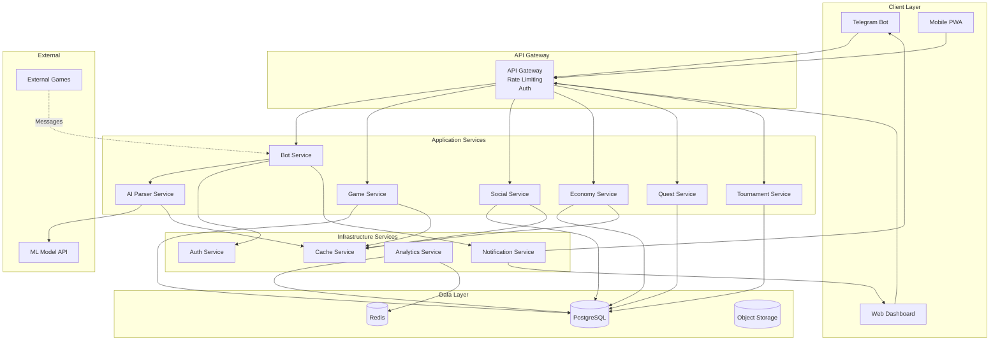

# Design Document: Ultimate Platform Upgrade

## Overview

This design transforms the LucasTeam Meta-Gaming Platform from a functional Telegram bot into an enterprise-grade gaming and social platform. The upgrade introduces AI/ML capabilities, advanced gaming systems, social features, enhanced economy, comprehensive gamification, modern technical infrastructure, and robust admin tools.

### Current System
- Python 3.8+ Telegram bot with 50+ commands
- SQLite database with SQLAlchemy ORM
- Bank aggregator collecting from 4 games
- Shop, achievement, and admin systems
- 22+ active users, 15,000+ lines of code, 100+ tests
- Hypothesis for property-based testing

### Target Architecture
- Microservices architecture with API gateway
- PostgreSQL primary database with Redis caching
- AI/ML service for intelligent parsing
- WebSocket server for real-time updates
- Web dashboard (React/Vue) and admin panel
- RESTful API for external integrations
- Webhook-based Telegram bot
- Comprehensive monitoring and analytics

### Design Principles
1. **Scalability**: Support 10,000+ concurrent users
2. **Reliability**: 99.9% uptime with automated failover
3. **Performance**: Sub-second response times for 95% of requests
4. **Security**: End-to-end encryption, audit logging, fraud detection
5. **Maintainability**: Modular architecture with clear separation of concerns
6. **Extensibility**: Plugin system for new games and features

## Architecture

### System Components



### Service Responsibilities

**Bot Service**: Telegram webhook handling, command routing, user session management
**AI Parser Service**: ML-based message classification, entity extraction, confidence scoring
**Game Service**: Mini-games logic, D&D workshop, game state management
**Social Service**: Friends, clans, chat, profiles, activity feeds
**Economy Service**: Currency, shop, trading, auctions, banking, dynamic pricing
**Quest Service**: Quest management, storylines, progress tracking, battle pass
**Tournament Service**: Tournament brackets, match management, prize distribution
**Auth Service**: OAuth 2.0, JWT tokens, session management, permissions
**Notification Service**: Real-time WebSocket, push notifications, email
**Analytics Service**: Metrics collection, reporting, A/B testing, feature flags
**Cache Service**: Redis operations, cache invalidation, pub/sub


## Components and Interfaces

### AI Parser Service

**Purpose**: Intelligent classification and entity extraction from game messages using ML/NLP models.

**Technology Options**:
1. **Lightweight NLP**: spaCy with custom entity recognition, NLTK for preprocessing
2. **Transformer Models**: Hugging Face DistilBERT for classification (lightweight, fast)
3. **Custom ML**: Scikit-learn ensemble (Random Forest + Gradient Boosting) for structured data
4. **Hybrid Approach**: Rule-based preprocessing + ML classification + entity extraction

**Recommended Approach**: Hybrid system with spaCy for entity recognition and DistilBERT for game classification.

**Interface**:
```python
class AIParserService:
    def parse_message(self, text: str) -> ParseResult:
        """
        Parse game message and extract structured data.
        
        Args:
            text: Raw message text
            
        Returns:
            ParseResult with game_type, confidence, entities
        """
        pass
    
    def retrain_model(self, training_data: List[LabeledMessage]) -> ModelMetrics:
        """Retrain model with new labeled data."""
        pass
    
    def get_model_metrics(self) -> ModelMetrics:
        """Get current model performance metrics."""
        pass

@dataclass
class ParseResult:
    game_type: str  # "shmalala", "gd_cards", "true_mafia", "bunker_rp"
    confidence: float  # 0.0 to 1.0
    entities: List[Entity]
    raw_text: str
    timestamp: datetime

@dataclass
class Entity:
    type: str  # "currency_amount", "currency_name", "action", "player_name"
    value: Any
    confidence: float
    span: Tuple[int, int]  # Character positions in text
```

**ML Pipeline**:
1. **Preprocessing**: Tokenization, lowercasing, special character handling
2. **Feature Extraction**: TF-IDF, word embeddings, game-specific patterns
3. **Classification**: Multi-class classifier for game type
4. **Entity Extraction**: Named entity recognition for amounts, currencies, actions
5. **Confidence Scoring**: Ensemble voting, calibration
6. **Fallback Logic**: Rule-based regex when confidence < 0.8

**Training Data Management**:
- Store labeled messages in PostgreSQL with version tracking
- Admin corrections automatically added to training set
- Periodic retraining (weekly) with new data
- A/B testing for model versions

**Caching Strategy**:
- Cache parse results by message hash (MD5) in Redis
- TTL: 7 days for successful parses
- Invalidate on model updates


### Game Service

**Mini-Games Implementation**:

**Cities Game**:
```python
class CitiesGame:
    def __init__(self, players: List[User], city_database: CityDB):
        self.players = players
        self.used_cities = set()
        self.current_player_idx = 0
        self.last_letter = None
        
    def make_move(self, city: str) -> MoveResult:
        """
        Validate and process city move.
        
        Rules:
        - City must start with last letter of previous city
        - City must not have been used before
        - City must exist in database
        """
        if not self.is_valid_city(city):
            return MoveResult(valid=False, reason="City not found")
        
        if city.lower() in self.used_cities:
            return MoveResult(valid=False, reason="City already used")
        
        if self.last_letter and not city[0].lower() == self.last_letter:
            return MoveResult(valid=False, reason=f"Must start with '{self.last_letter}'")
        
        self.used_cities.add(city.lower())
        self.last_letter = city[-1].lower()
        self.advance_turn()
        
        return MoveResult(valid=True, next_player=self.current_player)
```

**Killer Words Game**:
```python
class KillerWordsGame:
    def __init__(self, players: List[User], word_database: WordDB):
        self.players = players
        self.used_letters = set()
        self.target_word = self.select_random_word()
        self.guessed_positions = {}
        
    def guess_letter(self, letter: str) -> GuessResult:
        """
        Process letter guess.
        
        Returns positions where letter appears or penalty.
        """
        if letter in self.used_letters:
            return GuessResult(valid=False, reason="Letter already used")
        
        self.used_letters.add(letter)
        positions = [i for i, c in enumerate(self.target_word) if c == letter]
        
        if positions:
            for pos in positions:
                self.guessed_positions[pos] = letter
            return GuessResult(valid=True, positions=positions, word_complete=self.is_complete())
        else:
            return GuessResult(valid=True, positions=[], penalty=True)
```

**GD Levels Game**:
```python
class GDLevelsGame:
    def __init__(self, difficulty: str):
        self.difficulty = difficulty
        self.current_level = 1
        self.score = 0
        
    def generate_challenge(self) -> Challenge:
        """Generate level challenge based on difficulty."""
        difficulty_multiplier = {"easy": 1, "medium": 2, "hard": 3}[self.difficulty]
        return Challenge(
            level=self.current_level,
            obstacles=self.current_level * difficulty_multiplier,
            time_limit=60 - (difficulty_multiplier * 10),
            reward=100 * difficulty_multiplier
        )
    
    def complete_level(self, time_taken: int, deaths: int) -> LevelResult:
        """Calculate score and advance level."""
        base_score = 100
        time_bonus = max(0, (60 - time_taken) * 2)
        death_penalty = deaths * 10
        
        level_score = base_score + time_bonus - death_penalty
        self.score += level_score
        self.current_level += 1
        
        return LevelResult(score=level_score, total_score=self.score, next_level=self.current_level)
```


**D&D Workshop**:
```python
class DnDWorkshop:
    def create_character(self, user: User, char_data: CharacterData) -> Character:
        """Create D&D 5e character with stats and inventory."""
        return Character(
            owner=user,
            name=char_data.name,
            race=char_data.race,
            char_class=char_data.char_class,
            level=1,
            stats=self.roll_stats(),
            hp=self.calculate_hp(char_data.char_class),
            inventory=[],
            backstory=char_data.backstory
        )
    
    def roll_dice(self, notation: str) -> DiceResult:
        """
        Roll dice using standard notation (e.g., "2d6+3", "d20").
        
        Supports: dX, NdX, NdX+M, NdX-M
        """
        import re
        import secrets
        
        pattern = r'(\d*)d(\d+)([+-]\d+)?'
        match = re.match(pattern, notation.lower())
        
        if not match:
            raise ValueError(f"Invalid dice notation: {notation}")
        
        num_dice = int(match.group(1) or 1)
        die_size = int(match.group(2))
        modifier = int(match.group(3) or 0)
        
        rolls = [secrets.randbelow(die_size) + 1 for _ in range(num_dice)]
        total = sum(rolls) + modifier
        
        return DiceResult(
            notation=notation,
            rolls=rolls,
            modifier=modifier,
            total=total,
            timestamp=datetime.now()
        )
    
    def create_session(self, dm: User, players: List[User], campaign: str) -> Session:
        """Create D&D session with participants."""
        return Session(
            dm=dm,
            players=players,
            campaign=campaign,
            state={},
            log=[],
            created_at=datetime.now()
        )
    
    def apply_damage(self, character: Character, damage: int) -> Character:
        """Apply damage and update character state."""
        character.hp = max(0, character.hp - damage)
        
        if character.hp == 0:
            character.status = "unconscious"
        
        return character
```

**Tournament System**:
```python
class TournamentSystem:
    def create_tournament(self, config: TournamentConfig) -> Tournament:
        """Create tournament with specified format."""
        return Tournament(
            name=config.name,
            format=config.format,  # "single_elim", "double_elim", "round_robin"
            game_type=config.game_type,
            max_participants=config.max_participants,
            prize_pool=config.prize_pool,
            start_date=config.start_date,
            brackets=None,
            state="registration"
        )
    
    def generate_brackets(self, tournament: Tournament, participants: List[User]) -> Brackets:
        """Generate tournament brackets based on format."""
        if tournament.format == "single_elim":
            return self._generate_single_elimination(participants)
        elif tournament.format == "double_elim":
            return self._generate_double_elimination(participants)
        elif tournament.format == "round_robin":
            return self._generate_round_robin(participants)
    
    def _generate_single_elimination(self, participants: List[User]) -> Brackets:
        """Create single elimination bracket tree."""
        import math
        
        # Pad to next power of 2
        bracket_size = 2 ** math.ceil(math.log2(len(participants)))
        byes = bracket_size - len(participants)
        
        # Shuffle and create initial matches
        shuffled = participants.copy()
        secrets.SystemRandom().shuffle(shuffled)
        
        matches = []
        for i in range(0, len(shuffled), 2):
            if i + 1 < len(shuffled):
                matches.append(Match(player1=shuffled[i], player2=shuffled[i+1]))
            else:
                matches.append(Match(player1=shuffled[i], player2=None))  # Bye
        
        return Brackets(rounds=[matches], current_round=0)
    
    def record_match_result(self, match: Match, winner: User) -> Match:
        """Record match result and advance winner."""
        match.winner = winner
        match.completed_at = datetime.now()
        match.state = "completed"
        
        return match
    
    def distribute_prizes(self, tournament: Tournament) -> List[PrizeDistribution]:
        """Distribute prizes to winners."""
        prize_distribution = {
            1: 0.50,  # 50% to 1st place
            2: 0.30,  # 30% to 2nd place
            3: 0.20   # 20% to 3rd place
        }
        
        results = []
        for rank, percentage in prize_distribution.items():
            winner = tournament.get_winner_by_rank(rank)
            amount = int(tournament.prize_pool * percentage)
            results.append(PrizeDistribution(user=winner, rank=rank, amount=amount))
        
        return results
```


### Social Service

**Friends System**:
```python
class FriendsService:
    def send_friend_request(self, sender: User, recipient: User) -> FriendRequest:
        """Send friend request with notification."""
        request = FriendRequest(
            sender=sender,
            recipient=recipient,
            status="pending",
            created_at=datetime.now()
        )
        
        self.notification_service.send(
            recipient,
            f"{sender.username} sent you a friend request"
        )
        
        return request
    
    def accept_friend_request(self, request: FriendRequest) -> Friendship:
        """Create bidirectional friendship."""
        friendship = Friendship(
            user1=request.sender,
            user2=request.recipient,
            created_at=datetime.now()
        )
        
        request.status = "accepted"
        
        return friendship
    
    def send_gift(self, sender: User, recipient: User, item: Item) -> Gift:
        """Transfer item as gift with daily limit check."""
        # Check daily limit
        today_gifts = self.count_gifts_today(sender)
        if today_gifts >= 10:
            raise GiftLimitExceeded("Maximum 10 gifts per day")
        
        # Validate sender has item
        if not sender.inventory.has_item(item):
            raise InsufficientItems("Item not in inventory")
        
        # Transfer item
        sender.inventory.remove_item(item)
        recipient.inventory.add_item(item)
        
        gift = Gift(
            sender=sender,
            recipient=recipient,
            item=item,
            timestamp=datetime.now()
        )
        
        self.notification_service.send(recipient, f"{sender.username} sent you {item.name}")
        
        return gift
```

**Clans System**:
```python
class ClansService:
    def create_clan(self, leader: User, name: str, description: str) -> Clan:
        """Create new clan with leader."""
        clan = Clan(
            name=name,
            description=description,
            leader=leader,
            members=[leader],
            level=1,
            experience=0,
            resources={},
            created_at=datetime.now()
        )
        
        return clan
    
    def join_clan(self, user: User, clan: Clan) -> Clan:
        """Add user to clan with size limit check."""
        if len(clan.members) >= 50:
            raise ClanFullError("Clan has reached maximum size")
        
        clan.members.append(user)
        user.clan_id = clan.id
        
        self.activity_service.post_activity(
            ActivityType.CLAN_JOIN,
            user=user,
            clan=clan
        )
        
        return clan
    
    def contribute_resources(self, user: User, clan: Clan, resources: Dict[str, int]) -> Clan:
        """Add user contribution to clan resources."""
        for resource_type, amount in resources.items():
            clan.resources[resource_type] = clan.resources.get(resource_type, 0) + amount
        
        # Check for goal completion
        completed_goals = self.check_clan_goals(clan)
        if completed_goals:
            self.distribute_clan_rewards(clan, completed_goals)
        
        return clan
    
    def transfer_leadership(self, clan: Clan, new_leader: User) -> Clan:
        """Transfer clan leadership."""
        if new_leader not in clan.members:
            raise ValueError("New leader must be clan member")
        
        clan.leader = new_leader
        
        self.notification_service.send_to_clan(
            clan,
            f"{new_leader.username} is now the clan leader"
        )
        
        return clan
    
    def check_inactive_leader(self, clan: Clan) -> Optional[User]:
        """Check if leader is inactive and find replacement."""
        if clan.leader.last_active < datetime.now() - timedelta(days=30):
            # Find most active member
            active_members = [m for m in clan.members if m != clan.leader]
            if active_members:
                most_active = max(active_members, key=lambda m: m.activity_score)
                return most_active
        
        return None
```


**Chat and Moderation**:
```python
class ChatService:
    def __init__(self, profanity_filter: ProfanityFilter, rate_limiter: RateLimiter):
        self.profanity_filter = profanity_filter
        self.rate_limiter = rate_limiter
    
    def send_message(self, sender: User, channel: Channel, content: str) -> Message:
        """Send message with filtering and rate limiting."""
        # Check rate limit
        if not self.rate_limiter.check(sender, limit=10, window=60):
            raise RateLimitExceeded("Maximum 10 messages per minute")
        
        # Check if user is muted
        if sender.is_muted():
            raise UserMutedError("You are currently muted")
        
        # Filter content
        filtered_content, violations = self.profanity_filter.filter(content)
        
        if violations:
            self.log_violation(sender, violations)
            if sender.violation_count >= 3:
                self.auto_mute(sender, duration=timedelta(hours=1))
        
        message = Message(
            sender=sender,
            channel=channel,
            content=filtered_content,
            timestamp=datetime.now()
        )
        
        # Broadcast to channel subscribers
        self.broadcast_message(channel, message)
        
        return message
    
    def report_message(self, reporter: User, message: Message, reason: str) -> Report:
        """Flag message for admin review."""
        report = Report(
            reporter=reporter,
            message=message,
            reason=reason,
            status="pending",
            created_at=datetime.now()
        )
        
        # Notify moderators
        self.notification_service.send_to_admins(
            f"New message report from {reporter.username}"
        )
        
        return report
    
    def mute_user(self, admin: User, user: User, duration: timedelta, reason: str) -> Mute:
        """Mute user for specified duration."""
        mute = Mute(
            user=user,
            admin=admin,
            duration=duration,
            reason=reason,
            expires_at=datetime.now() + duration
        )
        
        self.notification_service.send(
            user,
            f"You have been muted for {duration}. Reason: {reason}"
        )
        
        return mute
```

**Activity Feed**:
```python
class ActivityService:
    def post_activity(self, activity_type: ActivityType, user: User, **kwargs) -> Activity:
        """Post activity to user's feed and friends' feeds."""
        activity = Activity(
            type=activity_type,
            user=user,
            data=kwargs,
            timestamp=datetime.now()
        )
        
        # Add to user's feed
        self.add_to_feed(user, activity)
        
        # Add to friends' feeds
        friends = self.friends_service.get_friends(user)
        for friend in friends:
            self.add_to_feed(friend, activity)
        
        # Broadcast via WebSocket
        self.websocket_service.broadcast_activity(activity)
        
        return activity
    
    def get_feed(self, user: User, limit: int = 50, filters: Optional[List[ActivityType]] = None) -> List[Activity]:
        """Get user's activity feed with optional filtering."""
        query = self.db.query(Activity).filter(Activity.user_id == user.id)
        
        if filters:
            query = query.filter(Activity.type.in_(filters))
        
        activities = query.order_by(Activity.timestamp.desc()).limit(limit).all()
        
        return activities
    
    def react_to_activity(self, user: User, activity: Activity, reaction: str) -> Reaction:
        """Add reaction to activity."""
        reaction_obj = Reaction(
            user=user,
            activity=activity,
            reaction=reaction,
            timestamp=datetime.now()
        )
        
        # Notify activity owner
        if activity.user != user:
            self.notification_service.send(
                activity.user,
                f"{user.username} reacted to your activity"
            )
        
        return reaction_obj
```


### Economy Service

**Dynamic Pricing**:
```python
class DynamicPricingEngine:
    def calculate_price(self, item: Item, demand_data: DemandData) -> int:
        """Calculate item price based on supply and demand."""
        base_price = item.base_price
        
        # Calculate 7-day purchase trend
        recent_purchases = demand_data.purchases_last_7_days
        avg_purchases = demand_data.avg_purchases_per_week
        
        if avg_purchases == 0:
            demand_multiplier = 1.0
        else:
            demand_multiplier = recent_purchases / avg_purchases
        
        # Limit price change to ±20%
        demand_multiplier = max(0.8, min(1.2, demand_multiplier))
        
        # Apply seasonal modifiers
        seasonal_modifier = self.get_seasonal_modifier(item)
        
        new_price = int(base_price * demand_multiplier * seasonal_modifier)
        
        # Enforce min/max bounds
        new_price = max(item.min_price, min(item.max_price, new_price))
        
        return new_price
    
    def update_all_prices(self):
        """Daily price recalculation for all shop items."""
        items = self.db.query(Item).all()
        
        for item in items:
            demand_data = self.get_demand_data(item)
            new_price = self.calculate_price(item, demand_data)
            
            # Track price history
            self.record_price_change(item, item.current_price, new_price)
            
            item.current_price = new_price
            item.price_trend = self.calculate_trend(item)
        
        self.db.commit()
```

**Trading System**:
```python
class TradingService:
    def create_trade_offer(self, initiator: User, recipient: User, offer: TradeOffer) -> Trade:
        """Create trade offer with items and currency."""
        # Validate initiator has offered items
        for item in offer.initiator_items:
            if not initiator.inventory.has_item(item):
                raise InsufficientItems(f"Missing item: {item.name}")
        
        if initiator.balance < offer.initiator_currency:
            raise InsufficientFunds("Not enough currency")
        
        trade = Trade(
            initiator=initiator,
            recipient=recipient,
            initiator_items=offer.initiator_items,
            initiator_currency=offer.initiator_currency,
            recipient_items=offer.recipient_items,
            recipient_currency=offer.recipient_currency,
            status="pending",
            created_at=datetime.now()
        )
        
        self.notification_service.send(recipient, f"{initiator.username} sent you a trade offer")
        
        return trade
    
    def accept_trade(self, trade: Trade) -> Trade:
        """Execute trade atomically with transaction fee."""
        with self.db.begin():
            # Validate both parties still have items
            self._validate_trade_items(trade)
            
            # Calculate 5% transaction fee
            total_value = self._calculate_trade_value(trade)
            fee = int(total_value * 0.05)
            
            # Transfer items
            for item in trade.initiator_items:
                trade.initiator.inventory.remove_item(item)
                trade.recipient.inventory.add_item(item)
            
            for item in trade.recipient_items:
                trade.recipient.inventory.remove_item(item)
                trade.initiator.inventory.add_item(item)
            
            # Transfer currency
            trade.initiator.balance -= trade.initiator_currency + fee
            trade.recipient.balance += trade.initiator_currency
            
            trade.recipient.balance -= trade.recipient_currency
            trade.initiator.balance += trade.recipient_currency
            
            trade.status = "completed"
            trade.completed_at = datetime.now()
        
        return trade
    
    def detect_trade_scam(self, trade: Trade) -> Optional[ScamAlert]:
        """Analyze trade for scam patterns."""
        # Check for extreme value imbalance
        initiator_value = self._calculate_value(trade.initiator_items, trade.initiator_currency)
        recipient_value = self._calculate_value(trade.recipient_items, trade.recipient_currency)
        
        if initiator_value > 0 and recipient_value / initiator_value < 0.1:
            return ScamAlert(
                trade=trade,
                reason="Extreme value imbalance",
                severity="high"
            )
        
        # Check for known scam patterns
        if self._matches_scam_pattern(trade):
            return ScamAlert(
                trade=trade,
                reason="Matches known scam pattern",
                severity="critical"
            )
        
        return None
```


**Banking System**:
```python
class BankingService:
    def deposit_savings(self, user: User, amount: int) -> SavingsAccount:
        """Deposit currency into savings with 2% daily interest."""
        if user.balance < amount:
            raise InsufficientFunds("Not enough currency")
        
        user.balance -= amount
        
        if not user.savings_account:
            user.savings_account = SavingsAccount(user=user, balance=0)
        
        user.savings_account.balance += amount
        user.savings_account.last_interest_date = datetime.now()
        
        return user.savings_account
    
    def apply_daily_interest(self):
        """Apply 2% daily interest to all savings accounts."""
        accounts = self.db.query(SavingsAccount).all()
        
        for account in accounts:
            days_since_interest = (datetime.now() - account.last_interest_date).days
            
            if days_since_interest >= 1:
                interest = int(account.balance * 0.02 * days_since_interest)
                account.balance += interest
                account.last_interest_date = datetime.now()
                
                self.notification_service.send(
                    account.user,
                    f"Earned {interest} interest on savings"
                )
        
        self.db.commit()
    
    def request_loan(self, user: User, amount: int) -> Loan:
        """Evaluate creditworthiness and create loan."""
        max_loan = user.balance * 10
        
        if amount > max_loan:
            raise LoanLimitExceeded(f"Maximum loan: {max_loan}")
        
        # Calculate interest rate based on credit score
        credit_score = self.calculate_credit_score(user)
        interest_rate = self._calculate_interest_rate(credit_score)
        
        loan = Loan(
            user=user,
            principal=amount,
            remaining=amount,
            interest_rate=interest_rate,
            daily_payment=int(amount * 0.01),  # 1% daily
            next_payment_date=datetime.now() + timedelta(days=1),
            status="active"
        )
        
        user.balance += amount
        
        return loan
    
    def process_daily_payments(self):
        """Deduct daily loan payments."""
        loans = self.db.query(Loan).filter(Loan.status == "active").all()
        
        for loan in loans:
            if datetime.now() >= loan.next_payment_date:
                payment = loan.daily_payment
                interest = int(loan.remaining * loan.interest_rate)
                total_payment = payment + interest
                
                if loan.user.balance >= total_payment:
                    loan.user.balance -= total_payment
                    loan.remaining -= payment
                    loan.next_payment_date += timedelta(days=1)
                    
                    if loan.remaining <= 0:
                        loan.status = "paid"
                else:
                    # Late payment
                    late_fee = int(payment * 0.1)
                    loan.remaining += late_fee
                    loan.missed_payments += 1
                    
                    self.notification_service.send(
                        loan.user,
                        f"Missed loan payment. Late fee: {late_fee}"
                    )
        
        self.db.commit()
```

**Auction House**:
```python
class AuctionService:
    def create_auction(self, seller: User, item: Item, config: AuctionConfig) -> Auction:
        """Create auction with starting price and duration."""
        if not seller.inventory.has_item(item):
            raise InsufficientItems("Item not in inventory")
        
        # Remove item from seller inventory (held in escrow)
        seller.inventory.remove_item(item)
        
        auction = Auction(
            seller=seller,
            item=item,
            starting_price=config.starting_price,
            current_bid=config.starting_price,
            buyout_price=config.buyout_price,
            duration=config.duration,
            ends_at=datetime.now() + config.duration,
            status="active"
        )
        
        return auction
    
    def place_bid(self, bidder: User, auction: Auction, amount: int) -> Bid:
        """Place bid with validation."""
        if amount <= auction.current_bid:
            raise InvalidBid("Bid must exceed current bid")
        
        if bidder.balance < amount:
            raise InsufficientFunds("Not enough currency")
        
        # Refund previous highest bidder
        if auction.highest_bidder:
            auction.highest_bidder.balance += auction.current_bid
            self.notification_service.send(
                auction.highest_bidder,
                f"You were outbid on {auction.item.name}"
            )
        
        # Hold new bid amount
        bidder.balance -= amount
        
        auction.current_bid = amount
        auction.highest_bidder = bidder
        
        bid = Bid(
            auction=auction,
            bidder=bidder,
            amount=amount,
            timestamp=datetime.now()
        )
        
        # Check for buyout
        if auction.buyout_price and amount >= auction.buyout_price:
            self.complete_auction(auction)
        
        return bid
    
    def complete_auction(self, auction: Auction):
        """Transfer item to winner and currency to seller."""
        if auction.highest_bidder:
            # Transfer item to winner
            auction.highest_bidder.inventory.add_item(auction.item)
            
            # Transfer currency to seller (minus 10% fee)
            fee = int(auction.current_bid * 0.10)
            auction.seller.balance += (auction.current_bid - fee)
            
            self.notification_service.send(
                auction.highest_bidder,
                f"You won {auction.item.name} for {auction.current_bid}"
            )
            self.notification_service.send(
                auction.seller,
                f"Your auction sold for {auction.current_bid} (fee: {fee})"
            )
        else:
            # No bids, return item to seller
            auction.seller.inventory.add_item(auction.item)
        
        auction.status = "completed"
        auction.completed_at = datetime.now()
```


### Quest and Gamification Service

**Quest System**:
```python
class QuestService:
    def create_quest(self, quest_data: QuestData) -> Quest:
        """Create quest with objectives and rewards."""
        quest = Quest(
            title=quest_data.title,
            description=quest_data.description,
            quest_type=quest_data.quest_type,  # "daily", "story", "repeatable"
            objectives=[
                Objective(
                    description=obj.description,
                    target=obj.target,
                    progress=0
                ) for obj in quest_data.objectives
            ],
            rewards=quest_data.rewards,
            prerequisites=quest_data.prerequisites,
            next_quests=quest_data.next_quests  # For quest chains
        )
        
        return quest
    
    def accept_quest(self, user: User, quest: Quest) -> UserQuest:
        """Accept quest and track progress."""
        # Check prerequisites
        if not self._check_prerequisites(user, quest.prerequisites):
            raise PrerequisitesNotMet("Quest prerequisites not met")
        
        user_quest = UserQuest(
            user=user,
            quest=quest,
            status="active",
            objectives_progress={obj.id: 0 for obj in quest.objectives},
            started_at=datetime.now()
        )
        
        return user_quest
    
    def update_quest_progress(self, user_quest: UserQuest, objective_id: int, progress: int):
        """Update objective progress and check completion."""
        user_quest.objectives_progress[objective_id] = progress
        
        # Check if objective completed
        objective = next(obj for obj in user_quest.quest.objectives if obj.id == objective_id)
        if progress >= objective.target:
            self.notification_service.send(
                user_quest.user,
                f"Quest objective completed: {objective.description}"
            )
        
        # Check if all objectives completed
        if self._all_objectives_complete(user_quest):
            self.complete_quest(user_quest)
    
    def complete_quest(self, user_quest: UserQuest):
        """Award rewards and unlock next quests."""
        user = user_quest.user
        quest = user_quest.quest
        
        # Award rewards
        user.balance += quest.rewards.currency
        user.experience += quest.rewards.experience
        
        for item in quest.rewards.items:
            user.inventory.add_item(item)
        
        user_quest.status = "completed"
        user_quest.completed_at = datetime.now()
        
        # Unlock next quests in chain
        if quest.next_quests:
            for next_quest_id in quest.next_quests:
                self.unlock_quest(user, next_quest_id)
        
        self.notification_service.send(
            user,
            f"Quest completed: {quest.title}"
        )
```

**Challenge System**:
```python
class ChallengeService:
    def generate_daily_challenges(self, user: User) -> List[Challenge]:
        """Generate 3 personalized daily challenges."""
        challenge_pool = self._get_challenge_templates()
        
        # Personalize based on user activity
        user_stats = self.analytics_service.get_user_stats(user)
        personalized = self._personalize_challenges(challenge_pool, user_stats)
        
        # Select 3 challenges
        selected = secrets.SystemRandom().sample(personalized, 3)
        
        challenges = []
        for template in selected:
            challenge = Challenge(
                user=user,
                type="daily",
                title=template.title,
                description=template.description,
                target=template.target,
                progress=0,
                rewards=template.rewards,
                expires_at=datetime.now().replace(hour=23, minute=59, second=59)
            )
            challenges.append(challenge)
        
        return challenges
    
    def complete_challenge(self, challenge: Challenge):
        """Award rewards and update streak."""
        user = challenge.user
        
        # Award rewards
        user.balance += challenge.rewards.currency
        user.experience += challenge.rewards.experience
        
        # Update streak
        if challenge.type == "daily":
            user.daily_challenge_streak += 1
            
            # Streak bonuses at milestones
            if user.daily_challenge_streak % 7 == 0:
                bonus = 1000 * (user.daily_challenge_streak // 7)
                user.balance += bonus
                self.notification_service.send(
                    user,
                    f"7-day streak bonus: {bonus} currency!"
                )
        
        challenge.status = "completed"
        challenge.completed_at = datetime.now()
```


**Battle Pass System**:
```python
class BattlePassService:
    def create_season(self, season_data: SeasonData) -> BattlePass:
        """Create new battle pass season."""
        battle_pass = BattlePass(
            season_number=season_data.season_number,
            name=season_data.name,
            start_date=season_data.start_date,
            end_date=season_data.end_date,
            max_level=100,
            free_rewards=season_data.free_rewards,
            premium_rewards=season_data.premium_rewards,
            xp_per_level=1000
        )
        
        return battle_pass
    
    def award_xp(self, user: User, amount: int):
        """Award battle pass XP and level up."""
        if not user.battle_pass_progress:
            user.battle_pass_progress = BattlePassProgress(
                user=user,
                season=self.get_current_season(),
                level=1,
                xp=0,
                has_premium=False
            )
        
        progress = user.battle_pass_progress
        progress.xp += amount
        
        # Check for level ups
        while progress.xp >= progress.season.xp_per_level and progress.level < 100:
            progress.xp -= progress.season.xp_per_level
            progress.level += 1
            
            # Award rewards
            self._award_level_rewards(user, progress)
    
    def _award_level_rewards(self, user: User, progress: BattlePassProgress):
        """Award rewards for reaching level."""
        level = progress.level
        season = progress.season
        
        # Free rewards
        if level in season.free_rewards:
            rewards = season.free_rewards[level]
            self._apply_rewards(user, rewards)
        
        # Premium rewards
        if progress.has_premium and level in season.premium_rewards:
            rewards = season.premium_rewards[level]
            self._apply_rewards(user, rewards)
        
        self.notification_service.send(
            user,
            f"Battle Pass Level {level} reached!"
        )
    
    def purchase_premium(self, user: User) -> BattlePassProgress:
        """Unlock premium rewards."""
        progress = user.battle_pass_progress
        
        if progress.has_premium:
            raise AlreadyPremium("Already have premium battle pass")
        
        cost = 1000  # Premium currency
        if user.premium_currency < cost:
            raise InsufficientFunds("Not enough premium currency")
        
        user.premium_currency -= cost
        progress.has_premium = True
        
        # Award all premium rewards up to current level
        for level in range(1, progress.level + 1):
            if level in progress.season.premium_rewards:
                rewards = progress.season.premium_rewards[level]
                self._apply_rewards(user, rewards)
        
        return progress
    
    def purchase_level_skip(self, user: User, levels: int) -> BattlePassProgress:
        """Purchase level skips with premium currency."""
        cost_per_level = 100
        total_cost = cost_per_level * levels
        
        if user.premium_currency < total_cost:
            raise InsufficientFunds("Not enough premium currency")
        
        user.premium_currency -= total_cost
        
        progress = user.battle_pass_progress
        for _ in range(levels):
            if progress.level < 100:
                progress.level += 1
                self._award_level_rewards(user, progress)
        
        return progress
```

**Referral System**:
```python
class ReferralService:
    def generate_referral_code(self, user: User) -> str:
        """Generate unique referral code."""
        import hashlib
        
        code = hashlib.sha256(f"{user.id}{user.username}{datetime.now()}".encode()).hexdigest()[:8]
        
        user.referral_code = code
        
        return code
    
    def register_with_referral(self, new_user: User, referral_code: str):
        """Link new user to referrer."""
        referrer = self.db.query(User).filter(User.referral_code == referral_code).first()
        
        if not referrer:
            raise InvalidReferralCode("Referral code not found")
        
        if referrer == new_user:
            raise SelfReferralError("Cannot refer yourself")
        
        new_user.referred_by = referrer
        referrer.referral_count += 1
    
    def check_referral_milestone(self, user: User):
        """Check if user reached level 10 and reward referrer."""
        if user.level == 10 and user.referred_by and not user.referral_rewarded:
            referrer = user.referred_by
            
            # Award referrer
            rewards = {
                "currency": 5000,
                "items": [self.get_referral_bonus_item()]
            }
            
            referrer.balance += rewards["currency"]
            for item in rewards["items"]:
                referrer.inventory.add_item(item)
            
            referrer.active_referrals += 1
            user.referral_rewarded = True
            
            # Check milestone bonuses
            milestones = {5: 10000, 10: 25000, 25: 75000, 50: 200000}
            if referrer.active_referrals in milestones:
                bonus = milestones[referrer.active_referrals]
                referrer.balance += bonus
                self.notification_service.send(
                    referrer,
                    f"Referral milestone bonus: {bonus} currency!"
                )
            
            self.notification_service.send(
                referrer,
                f"{user.username} reached level 10! You earned referral rewards."
            )
```


### Infrastructure Services

**Analytics and A/B Testing**:
```python
class AnalyticsService:
    def track_event(self, user: User, event_type: str, properties: Dict[str, Any]):
        """Track user event for analytics."""
        event = AnalyticsEvent(
            user=user,
            event_type=event_type,
            properties=properties,
            timestamp=datetime.now()
        )
        
        # Store in PostgreSQL
        self.db.add(event)
        
        # Update Redis counters for real-time metrics
        self.redis.incr(f"event:{event_type}:count")
        self.redis.sadd(f"active_users:{datetime.now().date()}", user.id)
    
    def get_dashboard_metrics(self) -> DashboardMetrics:
        """Get real-time platform metrics."""
        today = datetime.now().date()
        
        return DashboardMetrics(
            active_users_now=self.redis.scard(f"active_users:{today}"),
            dau=self._calculate_dau(),
            mau=self._calculate_mau(),
            retention_rate=self._calculate_retention(),
            revenue_today=self._calculate_revenue(today),
            avg_session_duration=self._calculate_avg_session()
        )
    
    def create_ab_test(self, test_config: ABTestConfig) -> ABTest:
        """Create A/B test with variants."""
        test = ABTest(
            name=test_config.name,
            description=test_config.description,
            variants=test_config.variants,
            allocation=test_config.allocation,  # e.g., {"control": 0.5, "treatment": 0.5}
            metrics=test_config.metrics,
            start_date=datetime.now(),
            status="active"
        )
        
        return test
    
    def assign_variant(self, user: User, test: ABTest) -> str:
        """Assign user to test variant consistently."""
        # Use hash for consistent assignment
        import hashlib
        
        hash_input = f"{user.id}{test.id}".encode()
        hash_value = int(hashlib.md5(hash_input).hexdigest(), 16)
        random_value = (hash_value % 10000) / 10000
        
        cumulative = 0
        for variant, allocation in test.allocation.items():
            cumulative += allocation
            if random_value < cumulative:
                return variant
        
        return "control"
    
    def calculate_test_significance(self, test: ABTest) -> TestResults:
        """Calculate statistical significance of A/B test."""
        from scipy import stats
        
        results = {}
        for metric in test.metrics:
            control_data = self._get_variant_data(test, "control", metric)
            treatment_data = self._get_variant_data(test, "treatment", metric)
            
            # Perform t-test
            t_stat, p_value = stats.ttest_ind(control_data, treatment_data)
            
            results[metric] = {
                "control_mean": np.mean(control_data),
                "treatment_mean": np.mean(treatment_data),
                "p_value": p_value,
                "significant": p_value < 0.05,
                "lift": (np.mean(treatment_data) - np.mean(control_data)) / np.mean(control_data)
            }
        
        return TestResults(test=test, results=results)
```

**Feature Flags**:
```python
class FeatureFlagService:
    def create_flag(self, flag_data: FlagData) -> FeatureFlag:
        """Create feature flag."""
        flag = FeatureFlag(
            name=flag_data.name,
            description=flag_data.description,
            enabled=flag_data.enabled,
            rollout_percentage=flag_data.rollout_percentage,
            target_segments=flag_data.target_segments,
            dependencies=flag_data.dependencies
        )
        
        # Cache in Redis
        self.redis.set(f"flag:{flag.name}", json.dumps(flag.to_dict()))
        
        return flag
    
    def is_enabled(self, flag_name: str, user: User) -> bool:
        """Check if feature is enabled for user."""
        # Check cache first
        cached = self.redis.get(f"flag:{flag_name}")
        if cached:
            flag_data = json.loads(cached)
        else:
            flag = self.db.query(FeatureFlag).filter(FeatureFlag.name == flag_name).first()
            if not flag:
                return False
            flag_data = flag.to_dict()
        
        # Check if globally disabled
        if not flag_data["enabled"]:
            return False
        
        # Check dependencies
        for dep in flag_data.get("dependencies", []):
            if not self.is_enabled(dep, user):
                return False
        
        # Check segment targeting
        if flag_data.get("target_segments"):
            if not self._user_in_segments(user, flag_data["target_segments"]):
                return False
        
        # Check rollout percentage
        rollout = flag_data.get("rollout_percentage", 100)
        if rollout < 100:
            import hashlib
            hash_value = int(hashlib.md5(f"{user.id}{flag_name}".encode()).hexdigest(), 16)
            if (hash_value % 100) >= rollout:
                return False
        
        return True
    
    def update_flag(self, flag_name: str, updates: Dict[str, Any]):
        """Update feature flag and invalidate cache."""
        flag = self.db.query(FeatureFlag).filter(FeatureFlag.name == flag_name).first()
        
        for key, value in updates.items():
            setattr(flag, key, value)
        
        flag.updated_at = datetime.now()
        self.db.commit()
        
        # Update cache
        self.redis.set(f"flag:{flag_name}", json.dumps(flag.to_dict()))
        
        # Publish update event
        self.redis.publish("flag_updates", json.dumps({"flag": flag_name, "updates": updates}))
```


**Notification Service**:
```python
class NotificationService:
    def __init__(self, websocket_server: WebSocketServer, telegram_bot: TelegramBot):
        self.websocket_server = websocket_server
        self.telegram_bot = telegram_bot
    
    def send(self, user: User, message: str, notification_type: str = "info"):
        """Send notification via all available channels."""
        notification = Notification(
            user=user,
            message=message,
            type=notification_type,
            timestamp=datetime.now(),
            read=False
        )
        
        self.db.add(notification)
        
        # Send via WebSocket if user is online
        if self.websocket_server.is_connected(user):
            self.websocket_server.send_to_user(user, {
                "type": "notification",
                "data": notification.to_dict()
            })
        
        # Send via Telegram
        self.telegram_bot.send_message(
            chat_id=user.telegram_id,
            text=f"🔔 {message}"
        )
    
    def send_to_clan(self, clan: Clan, message: str):
        """Send notification to all clan members."""
        for member in clan.members:
            self.send(member, message, notification_type="clan")
    
    def send_to_admins(self, message: str):
        """Send notification to all admins."""
        admins = self.db.query(User).filter(User.is_admin == True).all()
        for admin in admins:
            self.send(admin, message, notification_type="admin")
```

**Cache Service**:
```python
class CacheService:
    def __init__(self, redis_client: Redis):
        self.redis = redis_client
    
    def get_or_compute(self, key: str, compute_fn: Callable, ttl: int = 3600) -> Any:
        """Get from cache or compute and cache."""
        cached = self.redis.get(key)
        
        if cached:
            return json.loads(cached)
        
        value = compute_fn()
        self.redis.setex(key, ttl, json.dumps(value))
        
        return value
    
    def invalidate(self, pattern: str):
        """Invalidate cache entries matching pattern."""
        keys = self.redis.keys(pattern)
        if keys:
            self.redis.delete(*keys)
    
    def get_leaderboard(self, leaderboard_name: str, limit: int = 100) -> List[LeaderboardEntry]:
        """Get leaderboard from Redis sorted set."""
        entries = self.redis.zrevrange(
            f"leaderboard:{leaderboard_name}",
            0,
            limit - 1,
            withscores=True
        )
        
        return [
            LeaderboardEntry(user_id=int(user_id), score=score)
            for user_id, score in entries
        ]
    
    def update_leaderboard(self, leaderboard_name: str, user_id: int, score: float):
        """Update user score in leaderboard."""
        self.redis.zadd(f"leaderboard:{leaderboard_name}", {user_id: score})
    
    def subscribe_to_events(self, channel: str, callback: Callable):
        """Subscribe to Redis pub/sub channel."""
        pubsub = self.redis.pubsub()
        pubsub.subscribe(channel)
        
        for message in pubsub.listen():
            if message["type"] == "message":
                callback(json.loads(message["data"]))
```

**Security and Audit**:
```python
class SecurityService:
    def log_audit_event(self, event_type: str, user: Optional[User], details: Dict[str, Any]):
        """Log security audit event."""
        audit_log = AuditLog(
            event_type=event_type,
            user=user,
            ip_address=details.get("ip_address"),
            user_agent=details.get("user_agent"),
            details=details,
            timestamp=datetime.now()
        )
        
        self.db.add(audit_log)
        
        # Also log to append-only file
        with open("/var/log/platform/audit.log", "a") as f:
            f.write(json.dumps(audit_log.to_dict()) + "\n")
    
    def check_rate_limit(self, user: User, action: str, limit: int, window: int) -> bool:
        """Check if user is within rate limit."""
        key = f"rate_limit:{user.id}:{action}"
        current = self.redis.get(key)
        
        if current and int(current) >= limit:
            return False
        
        pipe = self.redis.pipeline()
        pipe.incr(key)
        pipe.expire(key, window)
        pipe.execute()
        
        return True
    
    def detect_fraud(self, user: User, transaction: Transaction) -> Optional[FraudAlert]:
        """Detect fraudulent activity patterns."""
        # Check transaction velocity
        recent_transactions = self._get_recent_transactions(user, hours=1)
        if len(recent_transactions) > 50:
            return FraudAlert(
                user=user,
                reason="Excessive transaction velocity",
                severity="high"
            )
        
        # Check for unusual amounts
        avg_transaction = self._get_avg_transaction_amount(user)
        if transaction.amount > avg_transaction * 10:
            return FraudAlert(
                user=user,
                reason="Unusual transaction amount",
                severity="medium"
            )
        
        # Check for coordinated behavior
        if self._detect_coordinated_activity(user):
            return FraudAlert(
                user=user,
                reason="Coordinated account behavior",
                severity="critical"
            )
        
        return None
```


## Data Models

### Core Models

```python
from sqlalchemy import Column, Integer, String, DateTime, Boolean, ForeignKey, JSON, Float, Text
from sqlalchemy.orm import relationship
from sqlalchemy.ext.declarative import declarative_base

Base = declarative_base()

class User(Base):
    __tablename__ = "users"
    
    id = Column(Integer, primary_key=True)
    telegram_id = Column(Integer, unique=True, nullable=False)
    username = Column(String(255), unique=True, nullable=False)
    balance = Column(Integer, default=0)
    premium_currency = Column(Integer, default=0)
    level = Column(Integer, default=1)
    experience = Column(Integer, default=0)
    
    # Profile
    bio = Column(Text)
    avatar_url = Column(String(500))
    privacy_settings = Column(JSON, default={})
    
    # Social
    clan_id = Column(Integer, ForeignKey("clans.id"))
    referred_by_id = Column(Integer, ForeignKey("users.id"))
    referral_code = Column(String(8), unique=True)
    referral_count = Column(Integer, default=0)
    active_referrals = Column(Integer, default=0)
    
    # Gamification
    daily_challenge_streak = Column(Integer, default=0)
    login_streak = Column(Integer, default=0)
    loyalty_tier = Column(Integer, default=1)
    
    # Status
    is_admin = Column(Boolean, default=False)
    is_muted = Column(Boolean, default=False)
    muted_until = Column(DateTime)
    last_active = Column(DateTime)
    created_at = Column(DateTime, default=datetime.now)
    
    # Relationships
    inventory = relationship("InventoryItem", back_populates="user")
    achievements = relationship("UserAchievement", back_populates="user")
    friends = relationship("Friendship", foreign_keys="Friendship.user1_id")
    savings_account = relationship("SavingsAccount", uselist=False, back_populates="user")
    loans = relationship("Loan", back_populates="user")
    battle_pass_progress = relationship("BattlePassProgress", uselist=False, back_populates="user")

class Item(Base):
    __tablename__ = "items"
    
    id = Column(Integer, primary_key=True)
    name = Column(String(255), nullable=False)
    description = Column(Text)
    item_type = Column(String(50))  # "sticker", "privilege", "boost", "collectible"
    base_price = Column(Integer, nullable=False)
    current_price = Column(Integer, nullable=False)
    min_price = Column(Integer, nullable=False)
    max_price = Column(Integer, nullable=False)
    price_trend = Column(String(20))  # "rising", "falling", "stable"
    is_tradeable = Column(Boolean, default=True)
    rarity = Column(String(20))  # "common", "rare", "epic", "legendary"
    created_at = Column(DateTime, default=datetime.now)

class InventoryItem(Base):
    __tablename__ = "inventory_items"
    
    id = Column(Integer, primary_key=True)
    user_id = Column(Integer, ForeignKey("users.id"), nullable=False)
    item_id = Column(Integer, ForeignKey("items.id"), nullable=False)
    quantity = Column(Integer, default=1)
    acquired_at = Column(DateTime, default=datetime.now)
    
    user = relationship("User", back_populates="inventory")
    item = relationship("Item")

class Clan(Base):
    __tablename__ = "clans"
    
    id = Column(Integer, primary_key=True)
    name = Column(String(255), unique=True, nullable=False)
    description = Column(Text)
    leader_id = Column(Integer, ForeignKey("users.id"), nullable=False)
    level = Column(Integer, default=1)
    experience = Column(Integer, default=0)
    resources = Column(JSON, default={})
    max_members = Column(Integer, default=50)
    created_at = Column(DateTime, default=datetime.now)
    
    leader = relationship("User", foreign_keys=[leader_id])
    members = relationship("User", foreign_keys="User.clan_id")

class Friendship(Base):
    __tablename__ = "friendships"
    
    id = Column(Integer, primary_key=True)
    user1_id = Column(Integer, ForeignKey("users.id"), nullable=False)
    user2_id = Column(Integer, ForeignKey("users.id"), nullable=False)
    created_at = Column(DateTime, default=datetime.now)
    
    user1 = relationship("User", foreign_keys=[user1_id])
    user2 = relationship("User", foreign_keys=[user2_id])

class Trade(Base):
    __tablename__ = "trades"
    
    id = Column(Integer, primary_key=True)
    initiator_id = Column(Integer, ForeignKey("users.id"), nullable=False)
    recipient_id = Column(Integer, ForeignKey("users.id"), nullable=False)
    initiator_items = Column(JSON)  # List of item IDs
    recipient_items = Column(JSON)
    initiator_currency = Column(Integer, default=0)
    recipient_currency = Column(Integer, default=0)
    status = Column(String(20))  # "pending", "accepted", "rejected", "completed"
    created_at = Column(DateTime, default=datetime.now)
    completed_at = Column(DateTime)
    
    initiator = relationship("User", foreign_keys=[initiator_id])
    recipient = relationship("User", foreign_keys=[recipient_id])

class Tournament(Base):
    __tablename__ = "tournaments"
    
    id = Column(Integer, primary_key=True)
    name = Column(String(255), nullable=False)
    format = Column(String(50))  # "single_elim", "double_elim", "round_robin"
    game_type = Column(String(50))
    max_participants = Column(Integer)
    prize_pool = Column(Integer)
    brackets = Column(JSON)
    state = Column(String(20))  # "registration", "active", "completed"
    start_date = Column(DateTime)
    end_date = Column(DateTime)
    created_at = Column(DateTime, default=datetime.now)

class Quest(Base):
    __tablename__ = "quests"
    
    id = Column(Integer, primary_key=True)
    title = Column(String(255), nullable=False)
    description = Column(Text)
    quest_type = Column(String(20))  # "daily", "story", "repeatable"
    objectives = Column(JSON)
    rewards = Column(JSON)
    prerequisites = Column(JSON)
    next_quests = Column(JSON)  # Quest chain
    created_at = Column(DateTime, default=datetime.now)

class UserQuest(Base):
    __tablename__ = "user_quests"
    
    id = Column(Integer, primary_key=True)
    user_id = Column(Integer, ForeignKey("users.id"), nullable=False)
    quest_id = Column(Integer, ForeignKey("quests.id"), nullable=False)
    status = Column(String(20))  # "active", "completed", "failed"
    objectives_progress = Column(JSON)
    started_at = Column(DateTime, default=datetime.now)
    completed_at = Column(DateTime)
    
    user = relationship("User")
    quest = relationship("Quest")

class BattlePass(Base):
    __tablename__ = "battle_passes"
    
    id = Column(Integer, primary_key=True)
    season_number = Column(Integer, nullable=False)
    name = Column(String(255), nullable=False)
    start_date = Column(DateTime, nullable=False)
    end_date = Column(DateTime, nullable=False)
    max_level = Column(Integer, default=100)
    xp_per_level = Column(Integer, default=1000)
    free_rewards = Column(JSON)
    premium_rewards = Column(JSON)

class BattlePassProgress(Base):
    __tablename__ = "battle_pass_progress"
    
    id = Column(Integer, primary_key=True)
    user_id = Column(Integer, ForeignKey("users.id"), nullable=False)
    season_id = Column(Integer, ForeignKey("battle_passes.id"), nullable=False)
    level = Column(Integer, default=1)
    xp = Column(Integer, default=0)
    has_premium = Column(Boolean, default=False)
    
    user = relationship("User", back_populates="battle_pass_progress")
    season = relationship("BattlePass")
```


### AI and Analytics Models

```python
class ParsedMessage(Base):
    __tablename__ = "parsed_messages"
    
    id = Column(Integer, primary_key=True)
    user_id = Column(Integer, ForeignKey("users.id"), nullable=False)
    raw_text = Column(Text, nullable=False)
    game_type = Column(String(50))
    confidence = Column(Float)
    entities = Column(JSON)
    manually_reviewed = Column(Boolean, default=False)
    correct_classification = Column(String(50))  # For training data
    timestamp = Column(DateTime, default=datetime.now)
    
    user = relationship("User")

class AnalyticsEvent(Base):
    __tablename__ = "analytics_events"
    
    id = Column(Integer, primary_key=True)
    user_id = Column(Integer, ForeignKey("users.id"))
    event_type = Column(String(100), nullable=False)
    properties = Column(JSON)
    timestamp = Column(DateTime, default=datetime.now, index=True)
    
    user = relationship("User")

class ABTest(Base):
    __tablename__ = "ab_tests"
    
    id = Column(Integer, primary_key=True)
    name = Column(String(255), nullable=False)
    description = Column(Text)
    variants = Column(JSON)  # {"control": {...}, "treatment": {...}}
    allocation = Column(JSON)  # {"control": 0.5, "treatment": 0.5}
    metrics = Column(JSON)  # List of metrics to track
    status = Column(String(20))  # "active", "completed", "paused"
    start_date = Column(DateTime)
    end_date = Column(DateTime)

class FeatureFlag(Base):
    __tablename__ = "feature_flags"
    
    id = Column(Integer, primary_key=True)
    name = Column(String(255), unique=True, nullable=False)
    description = Column(Text)
    enabled = Column(Boolean, default=False)
    rollout_percentage = Column(Integer, default=100)
    target_segments = Column(JSON)  # User segments to target
    dependencies = Column(JSON)  # Other flags this depends on
    created_at = Column(DateTime, default=datetime.now)
    updated_at = Column(DateTime, default=datetime.now)

class AuditLog(Base):
    __tablename__ = "audit_logs"
    
    id = Column(Integer, primary_key=True)
    event_type = Column(String(100), nullable=False, index=True)
    user_id = Column(Integer, ForeignKey("users.id"))
    ip_address = Column(String(45))
    user_agent = Column(String(500))
    details = Column(JSON)
    timestamp = Column(DateTime, default=datetime.now, index=True)
    
    user = relationship("User")

class FraudAlert(Base):
    __tablename__ = "fraud_alerts"
    
    id = Column(Integer, primary_key=True)
    user_id = Column(Integer, ForeignKey("users.id"), nullable=False)
    alert_type = Column(String(100), nullable=False)
    reason = Column(Text)
    severity = Column(String(20))  # "low", "medium", "high", "critical"
    status = Column(String(20), default="pending")  # "pending", "reviewed", "false_positive"
    evidence = Column(JSON)
    created_at = Column(DateTime, default=datetime.now)
    reviewed_at = Column(DateTime)
    reviewed_by_id = Column(Integer, ForeignKey("users.id"))
    
    user = relationship("User", foreign_keys=[user_id])
    reviewed_by = relationship("User", foreign_keys=[reviewed_by_id])
```

### Game Models

```python
class GameSession(Base):
    __tablename__ = "game_sessions"
    
    id = Column(Integer, primary_key=True)
    game_type = Column(String(50), nullable=False)  # "cities", "killer_words", "gd_levels"
    players = Column(JSON)  # List of user IDs
    state = Column(JSON)  # Game-specific state
    status = Column(String(20))  # "active", "completed", "abandoned"
    winner_id = Column(Integer, ForeignKey("users.id"))
    started_at = Column(DateTime, default=datetime.now)
    ended_at = Column(DateTime)
    
    winner = relationship("User")

class DnDCharacter(Base):
    __tablename__ = "dnd_characters"
    
    id = Column(Integer, primary_key=True)
    user_id = Column(Integer, ForeignKey("users.id"), nullable=False)
    name = Column(String(255), nullable=False)
    race = Column(String(50))
    char_class = Column(String(50))
    level = Column(Integer, default=1)
    stats = Column(JSON)  # STR, DEX, CON, INT, WIS, CHA
    hp = Column(Integer)
    max_hp = Column(Integer)
    inventory = Column(JSON)
    backstory = Column(Text)
    status = Column(String(20), default="active")
    created_at = Column(DateTime, default=datetime.now)
    
    user = relationship("User")

class DnDSession(Base):
    __tablename__ = "dnd_sessions"
    
    id = Column(Integer, primary_key=True)
    dm_id = Column(Integer, ForeignKey("users.id"), nullable=False)
    campaign = Column(String(255))
    players = Column(JSON)  # List of user IDs
    state = Column(JSON)
    log = Column(JSON)  # Session event log
    created_at = Column(DateTime, default=datetime.now)
    last_activity = Column(DateTime, default=datetime.now)
    
    dm = relationship("User")

class DiceRoll(Base):
    __tablename__ = "dice_rolls"
    
    id = Column(Integer, primary_key=True)
    session_id = Column(Integer, ForeignKey("dnd_sessions.id"))
    user_id = Column(Integer, ForeignKey("users.id"), nullable=False)
    notation = Column(String(50), nullable=False)
    rolls = Column(JSON)
    modifier = Column(Integer, default=0)
    total = Column(Integer, nullable=False)
    timestamp = Column(DateTime, default=datetime.now)
    
    session = relationship("DnDSession")
    user = relationship("User")

class Auction(Base):
    __tablename__ = "auctions"
    
    id = Column(Integer, primary_key=True)
    seller_id = Column(Integer, ForeignKey("users.id"), nullable=False)
    item_id = Column(Integer, ForeignKey("items.id"), nullable=False)
    starting_price = Column(Integer, nullable=False)
    current_bid = Column(Integer, nullable=False)
    buyout_price = Column(Integer)
    highest_bidder_id = Column(Integer, ForeignKey("users.id"))
    status = Column(String(20))  # "active", "completed", "cancelled"
    ends_at = Column(DateTime, nullable=False)
    created_at = Column(DateTime, default=datetime.now)
    completed_at = Column(DateTime)
    
    seller = relationship("User", foreign_keys=[seller_id])
    item = relationship("Item")
    highest_bidder = relationship("User", foreign_keys=[highest_bidder_id])

class Loan(Base):
    __tablename__ = "loans"
    
    id = Column(Integer, primary_key=True)
    user_id = Column(Integer, ForeignKey("users.id"), nullable=False)
    principal = Column(Integer, nullable=False)
    remaining = Column(Integer, nullable=False)
    interest_rate = Column(Float, nullable=False)
    daily_payment = Column(Integer, nullable=False)
    next_payment_date = Column(DateTime, nullable=False)
    missed_payments = Column(Integer, default=0)
    status = Column(String(20))  # "active", "paid", "defaulted"
    created_at = Column(DateTime, default=datetime.now)
    
    user = relationship("User", back_populates="loans")

class SavingsAccount(Base):
    __tablename__ = "savings_accounts"
    
    id = Column(Integer, primary_key=True)
    user_id = Column(Integer, ForeignKey("users.id"), nullable=False, unique=True)
    balance = Column(Integer, default=0)
    interest_rate = Column(Float, default=0.02)  # 2% daily
    last_interest_date = Column(DateTime, default=datetime.now)
    created_at = Column(DateTime, default=datetime.now)
    
    user = relationship("User", back_populates="savings_account")
```


## Correctness Properties

*A property is a characteristic or behavior that should hold true across all valid executions of a system—essentially, a formal statement about what the system should do. Properties serve as the bridge between human-readable specifications and machine-verifiable correctness guarantees.*

### AI Parser Properties

**Property 1: Classification Accuracy**
*For any* test set of game messages with known classifications, the AI_Parser should achieve at least 95% classification accuracy.
**Validates: Requirements 1.1**

**Property 2: Entity Extraction Completeness**
*For any* game message containing currency information, the AI_Parser should extract both the currency amount and currency type.
**Validates: Requirements 1.2**

**Property 3: Low Confidence Fallback**
*For any* message where the AI_Parser returns confidence < 0.8, the message should be flagged for manual review.
**Validates: Requirements 1.3**

**Property 4: Response Structure Consistency**
*For any* message sent to AI_Parser_Service, the response should contain game_type, confidence score, and entities fields in valid JSON format.
**Validates: Requirements 1.1.4**

**Property 5: Cache Hit Performance**
*For any* message sent to AI_Parser_Service twice, the second request should be served from cache and complete faster than the first.
**Validates: Requirements 1.1.5, 10.1, 24.6**

### Game System Properties

**Property 6: Cities Game Rule Enforcement**
*For any* Cities game move, if the city name is invalid or already used or doesn't start with the required letter, the move should be rejected with a clear error message.
**Validates: Requirements 4.1, 4.7**

**Property 7: Dice Roll Distribution**
*For any* dice notation (e.g., "d20", "2d6+3"), rolling 1000 times should produce a distribution that matches the expected probability distribution within statistical bounds.
**Validates: Requirements 5.2**

**Property 8: Tournament Bracket Structure**
*For any* number of participants N, the generated single-elimination bracket should have exactly ceil(log2(N)) rounds and 2^ceil(log2(N)) - 1 total matches.
**Validates: Requirements 6.1**

**Property 9: Tournament Winner Advancement**
*For any* completed tournament match, the winner should appear in the next round's bracket and the loser should not.
**Validates: Requirements 6.2**

### Social System Properties

**Property 10: Friendship Bidirectionality**
*For any* accepted friend request between users A and B, both A should be in B's friends list and B should be in A's friends list.
**Validates: Requirements 8.2**

**Property 11: Gift Item Conservation**
*For any* gift transaction, the total number of items across sender and recipient inventories should remain constant (sender loses 1, recipient gains 1).
**Validates: Requirements 8.3**

**Property 12: Clan Membership Consistency**
*For any* user who joins a clan, the user should appear in the clan's member list and the user's clan_id should match the clan's id.
**Validates: Requirements 9.2**

**Property 13: Clan Size Limit**
*For any* clan with 50 members, attempting to add a 51st member should be rejected.
**Validates: Requirements 9.6**

### Economy Properties

**Property 14: Dynamic Pricing Bounds**
*For any* price adjustment, the new price should not differ from the old price by more than 20%.
**Validates: Requirements 13.1, 13.4**

**Property 15: Trade Atomicity**
*For any* trade between users A and B, either both item transfers and both currency transfers complete successfully, or none of them do (all-or-nothing).
**Validates: Requirements 14.3**

**Property 16: Trade Scam Detection**
*For any* trade where one side's value is less than 10% of the other side's value, the trade should be flagged as a potential scam.
**Validates: Requirements 14.8**

**Property 17: Savings Interest Accrual**
*For any* savings account with balance B, after N days, the balance should be B * (1.02)^N (2% daily compound interest).
**Validates: Requirements 15.1**

**Property 18: Loan Payment Deduction**
*For any* active loan, on each payment date, the user's balance should decrease by the daily payment amount plus interest.
**Validates: Requirements 15.3**

**Property 19: Auction Currency Conservation**
*For any* completed auction, the sum of (winner's payment + seller's received amount + platform fee) should equal the winning bid amount.
**Validates: Requirements 16.3, 16.4**

### Gamification Properties

**Property 20: Challenge Reward Distribution**
*For any* completed challenge, the user's balance should increase by the challenge's reward amount immediately.
**Validates: Requirements 18.2**

**Property 21: Quest Objective Progression**
*For any* quest with multiple objectives, completing objective N should unlock objective N+1 if it exists.
**Validates: Requirements 19.2**

**Property 22: Login Streak Behavior**
*For any* user, logging in on consecutive days should increment the streak counter, and missing a day should reset it to zero.
**Validates: Requirements 20.1, 20.3**

**Property 23: Battle Pass Level Progression**
*For any* user earning X experience points, if X >= xp_per_level, the user's battle pass level should increase by floor(X / xp_per_level).
**Validates: Requirements 21.2**

**Property 24: Referral Linking**
*For any* new user registering with a valid referral code, the new user's referred_by field should point to the referrer, and the referrer's referral_count should increment by 1.
**Validates: Requirements 22.2**

### Infrastructure Properties

**Property 25: Data Migration Completeness**
*For any* data in SQLite before migration, equivalent data should exist in PostgreSQL after migration with identical values.
**Validates: Requirements 23.1**

**Property 26: Leaderboard Update Latency**
*For any* user stat change, the corresponding leaderboard should reflect the change within 5 seconds.
**Validates: Requirements 7.2**

**Property 27: Notification Delivery Latency**
*For any* notification sent to an online user, the notification should be delivered within 1 second.
**Validates: Requirements 25.4**

**Property 28: API Rate Limiting**
*For any* user or API key, the 101st request within a 60-second window should be rejected with a rate limit error.
**Validates: Requirements 26.3, 32.1**

**Property 29: A/B Test Random Assignment**
*For any* A/B test with 50/50 allocation, assigning 1000 users should result in approximately 500 users in each variant (within 10% margin).
**Validates: Requirements 28.1**

**Property 30: Feature Flag Rollout Percentage**
*For any* feature flag with X% rollout, checking 1000 random users should result in approximately X% enabled (within 10% margin).
**Validates: Requirements 29.2**

**Property 31: Backup Integrity Verification**
*For any* created backup, restoring the backup should produce a database state identical to the state at backup time.
**Validates: Requirements 30.1, 30.5**

**Property 32: Audit Log Completeness**
*For any* authentication attempt, an audit log entry should be created with user_id, IP address, timestamp, and result.
**Validates: Requirements 31.1**

**Property 33: Real-Time Dashboard Sync**
*For any* action performed in the Telegram bot, the web dashboard should reflect the change within 2 seconds for connected users.
**Validates: Requirements 33.7**

**Property 34: Mobile Load Performance**
*For any* web dashboard page load on a simulated 3G connection, the page should be fully loaded and interactive within 3 seconds.
**Validates: Requirements 35.3**


## Error Handling

### Error Categories

**1. User Input Errors**
- Invalid commands or parameters
- Malformed data in API requests
- Constraint violations (e.g., insufficient funds, item not found)
- **Handling**: Return clear error messages, log for analytics, do not retry

**2. Business Logic Errors**
- Rule violations (e.g., clan size limit, rate limits)
- State conflicts (e.g., already in a game, auction already ended)
- Permission denied errors
- **Handling**: Return specific error codes, suggest corrective actions, log for monitoring

**3. External Service Errors**
- AI/ML service unavailable
- Telegram API failures
- Database connection issues
- **Handling**: Implement fallback mechanisms, retry with exponential backoff, alert admins

**4. System Errors**
- Out of memory, disk space
- Unhandled exceptions
- Data corruption
- **Handling**: Log with full context, alert admins immediately, attempt graceful degradation

### Error Response Format

```python
@dataclass
class ErrorResponse:
    error_code: str  # Machine-readable code (e.g., "INSUFFICIENT_FUNDS")
    message: str  # Human-readable message
    details: Optional[Dict[str, Any]]  # Additional context
    retry_after: Optional[int]  # Seconds to wait before retry (for rate limits)
    timestamp: datetime
```

### Fallback Strategies

**AI Parser Fallback**:
```python
def parse_message_with_fallback(text: str) -> ParseResult:
    try:
        # Try AI parser first
        result = ai_parser.parse(text)
        if result.confidence >= 0.8:
            return result
    except AIServiceUnavailable:
        logger.warning("AI service unavailable, using rule-based parser")
    
    # Fallback to rule-based parser
    return rule_based_parser.parse(text)
```

**Database Fallback**:
```python
def get_user_with_fallback(user_id: int) -> User:
    try:
        # Try primary database
        return primary_db.query(User).get(user_id)
    except DatabaseConnectionError:
        logger.error("Primary database unavailable, trying replica")
        return replica_db.query(User).get(user_id)
```

**Cache Fallback**:
```python
def get_leaderboard_with_fallback(name: str) -> List[LeaderboardEntry]:
    try:
        # Try cache first
        return cache.get_leaderboard(name)
    except RedisConnectionError:
        logger.warning("Cache unavailable, querying database")
        return db.query_leaderboard(name)
```

### Circuit Breaker Pattern

```python
class CircuitBreaker:
    def __init__(self, failure_threshold: int = 5, timeout: int = 60):
        self.failure_threshold = failure_threshold
        self.timeout = timeout
        self.failures = 0
        self.last_failure_time = None
        self.state = "closed"  # closed, open, half_open
    
    def call(self, func: Callable, *args, **kwargs):
        if self.state == "open":
            if datetime.now() - self.last_failure_time > timedelta(seconds=self.timeout):
                self.state = "half_open"
            else:
                raise CircuitBreakerOpen("Service temporarily unavailable")
        
        try:
            result = func(*args, **kwargs)
            if self.state == "half_open":
                self.state = "closed"
                self.failures = 0
            return result
        except Exception as e:
            self.failures += 1
            self.last_failure_time = datetime.now()
            
            if self.failures >= self.failure_threshold:
                self.state = "open"
            
            raise e
```

### Retry Logic

```python
def retry_with_backoff(func: Callable, max_retries: int = 3, base_delay: float = 1.0):
    """Retry function with exponential backoff."""
    for attempt in range(max_retries):
        try:
            return func()
        except RetryableError as e:
            if attempt == max_retries - 1:
                raise
            
            delay = base_delay * (2 ** attempt)
            logger.warning(f"Attempt {attempt + 1} failed, retrying in {delay}s: {e}")
            time.sleep(delay)
```

### Transaction Rollback

```python
def execute_trade_with_rollback(trade: Trade):
    """Execute trade with automatic rollback on failure."""
    savepoint = db.begin_nested()
    
    try:
        # Transfer items
        transfer_items(trade.initiator, trade.recipient, trade.initiator_items)
        transfer_items(trade.recipient, trade.initiator, trade.recipient_items)
        
        # Transfer currency
        transfer_currency(trade.initiator, trade.recipient, trade.initiator_currency)
        transfer_currency(trade.recipient, trade.initiator, trade.recipient_currency)
        
        # Deduct fee
        deduct_fee(trade.initiator, calculate_fee(trade))
        
        trade.status = "completed"
        savepoint.commit()
        
    except Exception as e:
        logger.error(f"Trade failed, rolling back: {e}")
        savepoint.rollback()
        trade.status = "failed"
        raise TradeExecutionError("Trade could not be completed") from e
```


## Testing Strategy

### Dual Testing Approach

The platform requires both **unit testing** and **property-based testing** for comprehensive coverage:

- **Unit Tests**: Validate specific examples, edge cases, error conditions, and integration points
- **Property Tests**: Verify universal properties across all inputs through randomization
- **Complementary Nature**: Unit tests catch concrete bugs, property tests verify general correctness

### Property-Based Testing Configuration

**Library Selection**: Use **Hypothesis** (already in use) for Python property-based testing

**Test Configuration**:
- Minimum 100 iterations per property test (due to randomization)
- Each property test must reference its design document property
- Tag format: `# Feature: ultimate-platform-upgrade, Property {number}: {property_text}`

**Example Property Test**:
```python
from hypothesis import given, strategies as st
import hypothesis

@given(
    balance=st.integers(min_value=0, max_value=1000000),
    days=st.integers(min_value=1, max_value=365)
)
@hypothesis.settings(max_examples=100)
def test_savings_interest_accrual(balance, days):
    """
    Feature: ultimate-platform-upgrade, Property 17: Savings Interest Accrual
    For any savings account with balance B, after N days, 
    the balance should be B * (1.02)^N
    """
    account = SavingsAccount(balance=balance)
    
    for _ in range(days):
        account.apply_daily_interest()
    
    expected = int(balance * (1.02 ** days))
    assert abs(account.balance - expected) <= 1  # Allow 1 unit rounding error
```

### Unit Testing Strategy

**Focus Areas for Unit Tests**:
1. **Specific Examples**: Concrete scenarios that demonstrate correct behavior
2. **Edge Cases**: Boundary conditions (empty lists, zero values, maximum limits)
3. **Error Conditions**: Invalid inputs, constraint violations, permission errors
4. **Integration Points**: Service interactions, database transactions, API contracts

**Example Unit Tests**:
```python
def test_clan_size_limit_edge_case():
    """Test that exactly 50 members are allowed, but 51 is rejected."""
    clan = create_clan("TestClan")
    
    # Add 50 members successfully
    for i in range(50):
        user = create_user(f"user{i}")
        clan.add_member(user)
    
    assert len(clan.members) == 50
    
    # 51st member should be rejected
    user51 = create_user("user51")
    with pytest.raises(ClanFullError):
        clan.add_member(user51)

def test_trade_atomicity_on_failure():
    """Test that trade rolls back completely on failure."""
    user_a = create_user_with_balance(1000)
    user_b = create_user_with_balance(500)
    item = create_item("Sword")
    user_a.inventory.add(item)
    
    # Create trade that will fail (insufficient funds for fee)
    trade = Trade(
        initiator=user_a,
        recipient=user_b,
        initiator_items=[item],
        initiator_currency=1000,  # All of user_a's money
        recipient_currency=0
    )
    
    with pytest.raises(InsufficientFunds):
        execute_trade(trade)
    
    # Verify rollback: user_a still has item and money
    assert item in user_a.inventory
    assert user_a.balance == 1000
    assert user_b.balance == 500

def test_ai_parser_fallback_on_low_confidence():
    """Test that low confidence triggers manual review."""
    ambiguous_message = "maybe won something?"
    
    result = ai_parser.parse(ambiguous_message)
    
    assert result.confidence < 0.8
    assert result.flagged_for_review == True
    
    # Verify message added to review queue
    review_queue = get_manual_review_queue()
    assert ambiguous_message in [msg.text for msg in review_queue]
```

### Integration Testing

**Test Scenarios**:
1. **End-to-End Flows**: Complete user journeys (register → play game → earn currency → purchase item)
2. **Service Integration**: Multiple services working together (AI Parser → Game Service → Economy Service)
3. **Real-Time Features**: WebSocket notifications, leaderboard updates, cache synchronization
4. **External Dependencies**: Telegram API, ML model API, database replication

**Example Integration Test**:
```python
@pytest.mark.integration
def test_complete_game_flow():
    """Test complete mini-game flow from start to reward."""
    user1 = create_user("player1")
    user2 = create_user("player2")
    
    # Start game
    game = game_service.start_cities_game([user1, user2])
    assert game.status == "active"
    
    # Play moves
    result1 = game.make_move(user1, "Moscow")
    assert result1.valid == True
    
    result2 = game.make_move(user2, "Warsaw")
    assert result2.valid == True
    
    # Invalid move (doesn't start with 'W')
    result3 = game.make_move(user1, "Berlin")
    assert result3.valid == False
    
    # Valid move
    result4 = game.make_move(user1, "Washington")
    assert result4.valid == True
    
    # End game
    game.end_game(winner=user1)
    
    # Verify rewards
    assert user1.balance > 0
    assert game.status == "completed"
    
    # Verify leaderboard update
    leaderboard = leaderboard_service.get_leaderboard("cities_wins")
    assert user1.id in [entry.user_id for entry in leaderboard]
```

### Performance Testing

**Key Metrics**:
- API response time: p95 < 200ms, p99 < 500ms
- Database query time: p95 < 50ms
- Cache hit rate: > 90% for frequently accessed data
- WebSocket message delivery: < 1 second
- Concurrent users: Support 10,000+ simultaneous connections

**Load Testing**:
```python
from locust import HttpUser, task, between

class PlatformUser(HttpUser):
    wait_time = between(1, 3)
    
    @task(3)
    def view_leaderboard(self):
        self.client.get("/api/leaderboards/currency")
    
    @task(2)
    def view_shop(self):
        self.client.get("/api/shop/items")
    
    @task(1)
    def purchase_item(self):
        self.client.post("/api/shop/purchase", json={"item_id": 1})
```

### Test Coverage Goals

- **Unit Test Coverage**: > 80% line coverage
- **Property Test Coverage**: All 34 correctness properties implemented
- **Integration Test Coverage**: All major user flows covered
- **Performance Test Coverage**: All critical endpoints load tested

### Continuous Testing

**CI/CD Pipeline**:
1. **On Commit**: Run unit tests and fast property tests (10 examples)
2. **On PR**: Run full test suite including integration tests
3. **Nightly**: Run comprehensive property tests (1000 examples), performance tests
4. **Pre-Deploy**: Run smoke tests against staging environment

**Test Automation**:
```yaml
# .github/workflows/test.yml
name: Test Suite

on: [push, pull_request]

jobs:
  unit-tests:
    runs-on: ubuntu-latest
    steps:
      - uses: actions/checkout@v2
      - name: Run unit tests
        run: pytest tests/unit -v --cov
  
  property-tests:
    runs-on: ubuntu-latest
    steps:
      - uses: actions/checkout@v2
      - name: Run property tests
        run: pytest tests/properties -v --hypothesis-profile=ci
  
  integration-tests:
    runs-on: ubuntu-latest
    services:
      postgres:
        image: postgres:14
      redis:
        image: redis:7
    steps:
      - uses: actions/checkout@v2
      - name: Run integration tests
        run: pytest tests/integration -v
```

